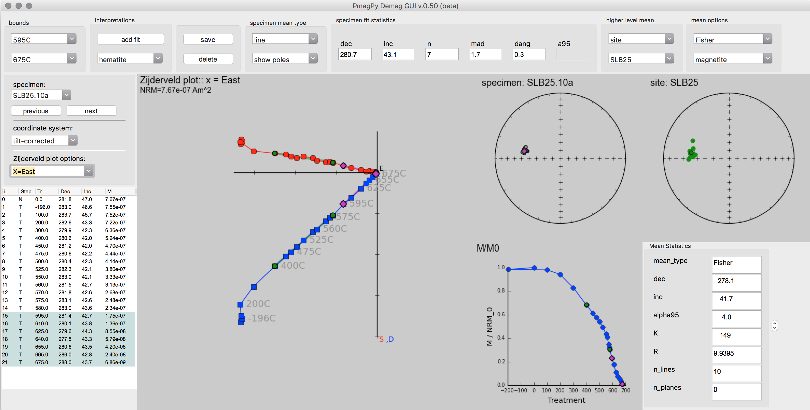
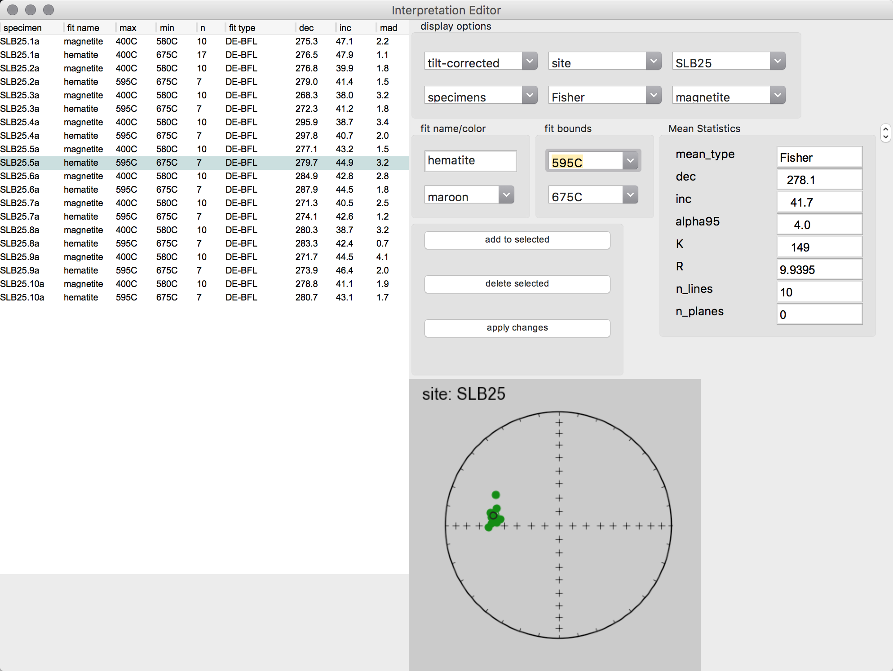

# demag_gui.py usage and tips
The demag_gui program enables the display and analysis of paleomagnetic demagnetization data. The software will display specimen level data within the chosen directory as a Zijderveld plot, equal area plot and intensity plot. Interpretations can be made to the data as least-squares line or plane fits. These interpretations can then be exported within MagIC pmag files.



## Installing

This program is part of the [PmagPy repository](https://github.com/ltauxe/PmagPy) which can be downloaded or cloned from Github. To run demag_gui.py it is necessary to download and install a working version of [python 2.7](https://www.python.org/downloads/), the latest version of the GUI library [wxpython](http://www.wxpython.org/download.php), and the basic scientific libraries that are part of the [scipy project](http://www.scipy.org/install.html). The easiest way to get all that you need is to install the Enthought Canopy distribution as described in the PmagPy cookbook: http://earthref.org/PmagPy/cookbook/#QQ2-1-2.

## Launching
The best way to launch the demag_gui application is through the QuickMagIC app. If PmagPy has been added to your PATH you can type QuickMagIC.py at the command line to launch it or you can navigate to the directory containing it and type ```python ./QuickMagIC.py```. Within the QuickMagIC app, data can be converted from the format of a particular lab into MagIC format so that it can be displayed and analyzed within the demag_gui. The program can be started by clicking on the demag_gui button in the QuickMagIC GUI, shown below.


Alternatively, the demag_gui may be launched through the command line by navigating to the directory containing demag_gui.py and running it with:

```bash
python ./demag_gui.py
```

Or if PmagPy has been added to your PATH you can simply type demag_gui.py at the command line. **Note:** on OSX it is recommended to launch through the QuickMagIC program as on wxpython 2.9 the drop down boxes behave better when demag_gui is launched this way.

## Interpretation of Specimen Data

### Adding Interpretations:  
A least-squares fit to the measurement data can be added by clicking the add fit button. Additionally, you can select the fit you would like to edit or view by using the drop down box under the add fit button. Once you have selected a fit, the shape of the end points of the selected fit will turn to a diamond shape to distinguish them from the other data points.  


Once the desired fit is selected, its bounds can be edited using the drop-down boxes under the bounds header.


Alternatively, one can double-click the list of measurement steps on the left to pick out the bounds for the interpretation. The included steps in the currently selected interpretation are shown in highlighted in blue on the measurement list and the measurements marked "bad" are shown in yellow. **Note:** in case of duplicate measurements the first *good* measurement with the same treatment is used.  


When first created, the fit will be given a generic name such as *Fit 1*. The name of the fit can be changed from the default by typing into the drop down box containing fit name then pressing enter. The default fit type is a least-squares line. You can choose different fits such as a line anchored to the origin or a plane by using the drop down menu under specimen mean type. Planes can be plotted as either poles, full planes or partial planes. This display option can be changed in the second drop-down menu under specimen mean type.


The choice between coordinate systems (i.e. specimen, geographic or tilt-corrected) is available on the left above the list of steps. The orientation of the Zijderveld projection can also be changed here.


The properties of the currently selected fit to the data can be seen in the upper center of the GUI in a box labeled specimen mean statistics.


### Flagging Bad Measurement Data
Due to flux jumps or other such errors, individual measurements should sometime be excluded from interpretation. Such a measurements can be flagged as "bad" by right-clicking them within the measurement list and the measurement will then be highlighted in yellow. The measurement_flag in the magic_measurements file will be change from "g" to "b" when a measurement is marked as "bad" and the step will not be included in fits that are made to the data. Any measurement marked as 'bad' will be colored yellow in the step list and will be shown as an empty rather than filled circle on the Zijdeveld, equal area and M/M_0 plots. To change a 'bad' measurement back to being 'good' one can right click on it again. Upon doing so, the yellow highlighting will go away, the data will be shown colored in within the plots and any fit that spans that data point will be recalculated to include it.

Acceptance criteria can be set by using Analysis/"Acceptance Criteria"/"Change Acceptance Criteria". These criteria will be written to a pmag_criteria table.

### Plot Interface
The 4 plots that take up the majority of the center of the GUI are where data and their interpretations are displayed. The Zijderveld and the 2 equal area plots are by default set to zoom when you left click and drag your left mouse button you will zoom to the dragged out rectangle (currently equal area plots do not draw this rectangle as you drag your mouse, but still zoom). On the Zijderveld plot, it is possible to switch between zoom and pan functionality by right clicking. Once in pan mode, the mouse will turn into a hand allowing you then to click and move around the plot. On both the Zijderveld and equal area plots if you wish to return to the original plot simply click the middle mouse button to return to home position. **Note:** in the absence of a middle mouse button pressing both right and left mouse buttons at the same time works on most laptops in the case of Macbooks clicking with two fingers should work, and if using Apple's magic mouse we recommend you download the [MagicPrefs](http://magicprefs.com/) program which will allow you to configure your mouse however you prefer. One the equal area plots you can double click on an interpretation to switch the specimen and current interpretation to the clicked interpretation.

### Saving Specimen Interpretations

Once you have picked out your interpretations, you can save the session data in two different ways: (1) as a .redo file which will allow you to have the fits preserved to be view again with demag_gui or (2) as MagIC pmag tables to be uploaded to the MagIC database or otherwise processed. In addition, you may save image files of the plots.

#### The .redo File:

You can use Analysis/"Save current interpretations to a redo file" to create this file type or you can just hit the save button next to add fit. **Note:** this file type does **NOT** load previous interpretations on start up you must go to the menu option Analysis/"Import previous interpretations from a redo file" to restore your previous session.

#### The Pmag Tables:

By going to the menu File/"Save MagIC pmag tables" you can export your interpretations made in Demag GUI to the MagIC pmag tables which can then be used by other MagIC programs or uploaded to the MagIC database. You can export any or all of the 3 coordinate systems upon selecting this option and you may choose to save pmag_samples, pmag_sites, and pmag_results tables in addition to the pmag_specimens table that is output. If you choose to output additional information you will be prompted by a pop up window for additional information. **Note:** this save format loads on start up of the GUI immediately restoring your session. Selection of this option will overwrite your demag_gui.redo file in the working directory.  

#### Images of Plots:

Select the menu option File/"Save plot"/"Save all plots" to save all plots. Alternatively, you can save any of the plots individually. If you zoom on any of the plots the zoomed image will be saved not the originally plotted image although the plot will redraw and reset the zoom level.

<!---
Some example images can be seen below:

  
  
  
  
\pagebreak
-->

### Deleting Specimen Interpretations

If you would like to delete a single interpretation, select the one you wish to delete from the interpretation drop down menu and click delete. Alternatively, if you wish to clear all interpretations you may go into the interpretation editor located under the tools menu, select the fits you wish to delete and click the "delete selected" button.  
<!---  -->

## Higher Level Plots and Interpretation

The set of drop down boxes to the right of the interpretation data are there to determine what level you want to analyze in the higher level analysis options include: site, sample, location, and study. The drop down below this selects which of the available sites, samples, location, or studies to display.
<!---  -->

You can then select how to group your data by using the drop down menu under the show header. You can select what kind of mean to take using the first drop down under the mean header. Which interpretations to use for the means can be selected under the second drop down menu.
<!---   -->

The mean statistics for the chosen higher level mean are displayed in the lower right of the GUI.
<!---   -->

### Interpretation Editor

In order to more easily view and edit specimen interpretation data there is a specimen interpretation editor which can be launched from the tools menu. This panel details the fits made to the data and their parameters from which you can select which interpretation to view by double clicking on it. In the list, the currently selected interpretation is highlighted blue as shown in the image below. You can mark interpretations as bad which removes them from any Fisher means or other high level means by right clicking on their entry in the list. All interpretations marked bad are colored yellow in the list and marked as a 'x' on the plot. The specimen entry associated with this fit will be given a bad ('b') flag within the pmag_specimens table. Interpretations can be highlighted by clicking on the list and holding the shift or ctrl/command key to select multiple interpretations. Doing so allows you to delete or alter the characteristics of multiple interpretations at once without having to select each one in turn. This mass alteration is allowable using the the Name/Color/Bounds boxes to input the changes and then clicking the "apply changes to highlighted fits" button. You can delete highlighted fits using the "delete highlighted fits" button. The "add fit" button in the interpretation editor adds a fit to the current specimen. In the case of interpreting large data sets, you can reduce the number of items plotted on the equal area at the bottom of the editor and the number of entries in the log by changing the display settings. The equal area plot on the bottom works just like the higher level equal area on the main Demag GUI panel allowing you to select interpretations on it by double clicking and to zoom by clicking and dragging.


