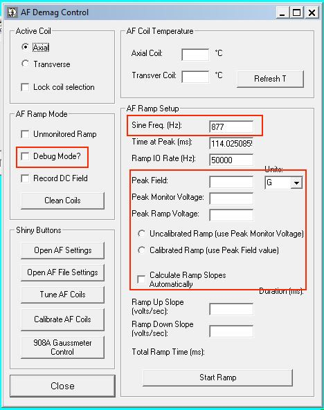
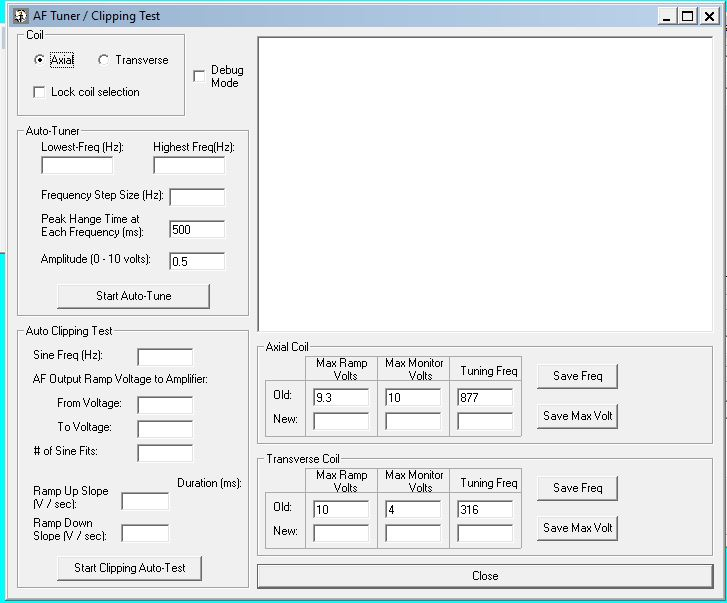
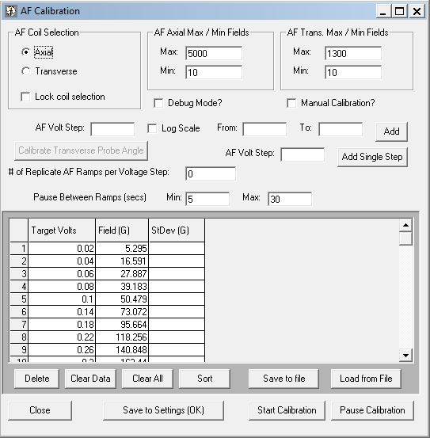

# Alternating Field (AF) demagnetization system tuning, clipping test, and calibration

### Reason to tune the AF

When operating the AF system for AF demagnetization experiments, you might hear the coils "singing", particularly when they are reaching high fields. This is due to the AF coils vibrating in the chamber as the alternating currents oscillate in the coil. Ideally, the coils are tightly wrapped such that the physical properties of the coils do not change through time. However, as the coils vibrate during real experiments, age through time, and perhaps melt (!) they can change such that the input voltage-output field correlation calibrated earlier no longer holds exactly. Therefore we need to tune the AF from time to time. 

### Reason to do a clipping test

The AF system works by having a signal generator (i.e. our Adwin box) which sends sinusoidal signals to an amplifier (i.e. the old Crest Amplifier or the newer QSC amplifier) which then amplifies the signal and send output power to the coils to eventually generate the fields. The clipping test is designed to test the capacity of an amplifier. When the power delivered to the coils are too high, the return power from the coils to the amplifier can blow up a Crest amplifier and can cause the QSC amplifier's circuit breaker (this is why QSC is better and safer than the Crest). Knowing when the QSC amplifier clips is good for knowing the capacity of the system. The maximum power a QSC PL380 can draw is 8000W (when using dual channels in bridge mode-4000W each channel, which is what we do). The QSC can drive our axial coils to >0.5T and transverse >170mT. 

### Reason to calibrate the coils

Similar to the reason to tune the AF. Calibrating the coils helps keeping the generated AF fields well accurate. 

## Measure the coils resistance

As a first step, it is good to check whether the coils are in good shape before any further operations. It is easy to measure the resistance of the axial and transverse coils simply with a multimeter. The transverse coils should have a resistance of ~9-10 ohm, slightly higher than the axial coils which have a resistance of ~2-3 ohm. 

## Put in the Hall probe to the AF coil level

The Hall probe is essential in calibrating the AF system. One needs to plug in the axial/transverse sensor in the probe meter, shove the probe and the cable in the glass tube, then use the motor control to lower the probe carefully to AF sensing region. Use slow motor speed (10000000; ten million) and make sure to only activate the up/down motor when moving to position (the program resets motor connection every single time!!!). 

Now we need to get the probe to the correct settings. We need to turn it to DC field, measure peak field (H_peak), and zero the probe before putting it in the AF region. There are a few ranges one can use, makesure to adjust the range to fit the fields you are testing. 

## AF demag control panel 

This is a panel where you are operate the AF coils independently for testing purposes. It is always good to test that the software and hardware can talk properly before and after repairing or installation of a new instrument. For our system at UC Berkeley, the axial coil has a resonance frequence of 877 Hz, wheras the transverse coil has a resonance frequency of 316 Hz. If the coils become loose due to vibration issues, the resonance frequency could change but we are so far so good. Note it would be idea if the frequencies are prime numbers but our transverse coils uses a frequency of 316 which is not a prime number. This is non-ideal but changing it to 317 Hz seems to cause a slight heating problem. 

To lightly test the coils, you can select a pair of coil, make sure the sine freq is right, and put in a peak field such as 100 G and use calibrate ramp option and hit start ramp. If no error occurs and the Hall probe shows a measurement, that means the software and hardware are talking properly. 

## AF tuner/Clipping test

After lightly testing the AF system, we start with the AF tuner/Clipping test window to tune the coils. 

1). Auto-Tune: Select a coil first. In the Auto-Tuner panel, set the lowest freq and highest freq to be bracketing the previous tuning freq set for this coil. We usually start coarse and narrow down. Say for axial coils, we can go with 850 Hz-900 Hz with a step size of 5 Hz, and then move toward 870 Hz to 885 Hz with step size of 1 Hz to slowly find the best resonance freq. We are looking for a bell curve and specifically identifying the peak Hz of the bell curve. Note it is th best to use integers for the freq values. set amplitude to 0.5. It is a good value to start as it produces ~20 mT field that is stable and measurable (the exact value depends on where you have the dial set on the amplifier). Hit start auto-tune, then identify the highest peak position to single digit level, record the Hz value, and hit "Save Freq". You should see the old freq being updated to the new value. Perform the same thing with both sets of coils.

2). Clipping test: At this step you need a helper to watch the amplifier outside of the shielded room for you while you operate the software inside the room. Make sure the loaded sine freq match the coil you would like to test. 

Check the "Debug mode" tick box on the top so that the data of each run is saved to folder `AF & IRM data`.

Start with low AF output ram voltage (0.5V) and slowly work your way up toward the highest value previously recorded (see the max ramp volts show on the right). **Make sure to adjus the ramp up slow and ramp down slope to be the same while keeping the total (ramp up+ ramp down) duration within 6s (we usually do 4 to 5 seconds).** After each clip test, make sure to let the coils cool down and in the meantime check the saved data files (usually the folder is named `Axial Clip xV + date`). In the folder there are two files of interest: `AFRamplitude+date.csv` and `AFramp_pts+date.csv`. Open these two files in excel and plot the **time vs. Monitor Volt**. Make sure to examine the plost and make sure that they are smooth and have sharp peaks. 

In the meantime, keep an eye on the amplifier to make sure it is not blowing up. Our system at UC Berkeley never triggered the amplifier circuit breaker even if the voltage was all the way rampped to 10V and the axial field was at 530 mT and the transverse was at 170mT. We however cap the system to be 9.3V for the axial system and 10V for the transverse. 

## AF Calibration

Once you have figured out the limit of the system, you can go ahead and calibrate the AF coils.  

The image shows the panel for AF calibration. It is good save a copy of the previous calibration file just in case the software fails midway through the calibration. 

Zeroing and properly positioning the Hall probe is essential in this step since the calibration is depended on the reading of the Hall probe at given voltages. 

Once you are ready (meaning the Hall probe, notebook, and AF system are ready), click "Start Calibration" and you should see the table changing from showing the previous calibration table to a bigger empty table that requires you set up a number of target volts and requires that one takes at least three measurements for each voltage for the calibration calculation. For potential data loss concerns, you'd better take notes on a piece of paper and on an excel sheet to record each Hall probe reading. One example of such excel sheet is  [Berkeley Axial Calibration - July 27, 2022.xlsx](Berkeley Axial Calibration - July 27, 2022.xlsx). 

After the calibration reading is done, you **DO NOT** want to use the software calculation as the final calibrated field vs. voltage values! You want to open the excel file or type in the values you recorded on the ntoebook to an excel sheet, fit a linear regresion through the values, use the linear equation to calculate for the expect field vs. voltage line and use the calculated values as input to the final table. Make sure to use a template (such as `Axial_Cal+date.csv`from folder `Calibration Values` and overwrite the columns "Target Mon. Volt. (V)" and "Field (G)" with the new calculated values. Click "Load from File" to read the .csv file and load the final values. Now we are all good! Note the process for calibrating one pair of coils can take 4 hours......!

One thing about calibration is that it is heavily dependent on the reading of the Hall probe. During the calibration process one will need to switch the Hall probe unit range such that we get the higher resolution reading at low fields and be able to read high fields. It is important to note that the Hall probe itself can have miscalibration between ranges. Therefore, the method to calibrate fields near to the maximum of a lower range is to use the two voltage leves just below the maximum of the lower range and record a total of six measurement at two Hall probe ranges. Use the redo function of the calibration panel to first record one measurement at the lower range but redo twice without recording in the panel (but take down notes), and do two more measurements with recording at the higher range. Reverse the recording in the next voltage level. In this way you can calcualte the average field reading across ranges to obtain a better fit for the data and smooth out the Hall probe range mismatch. 

