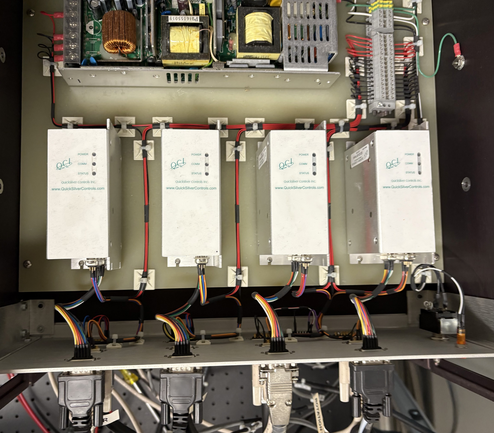
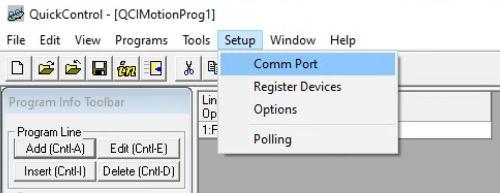
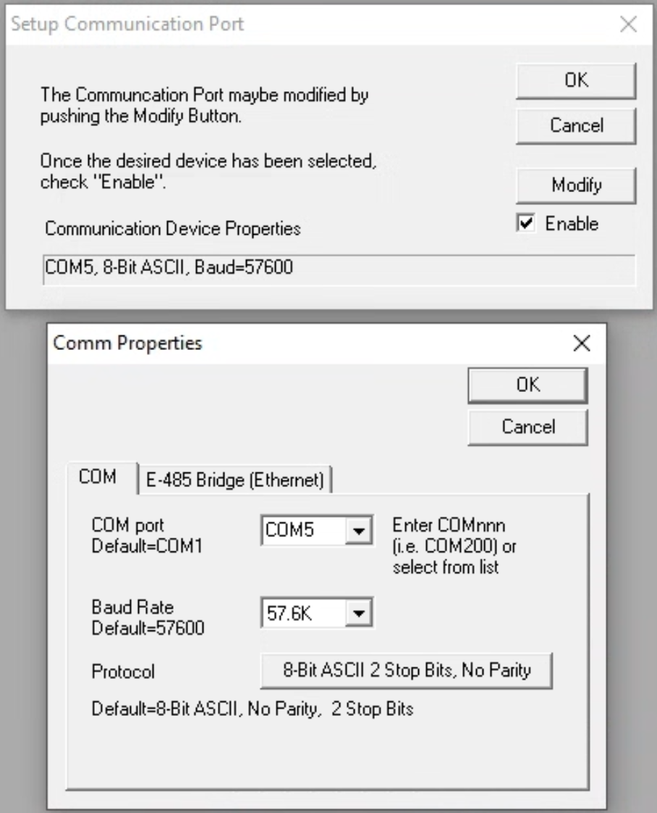
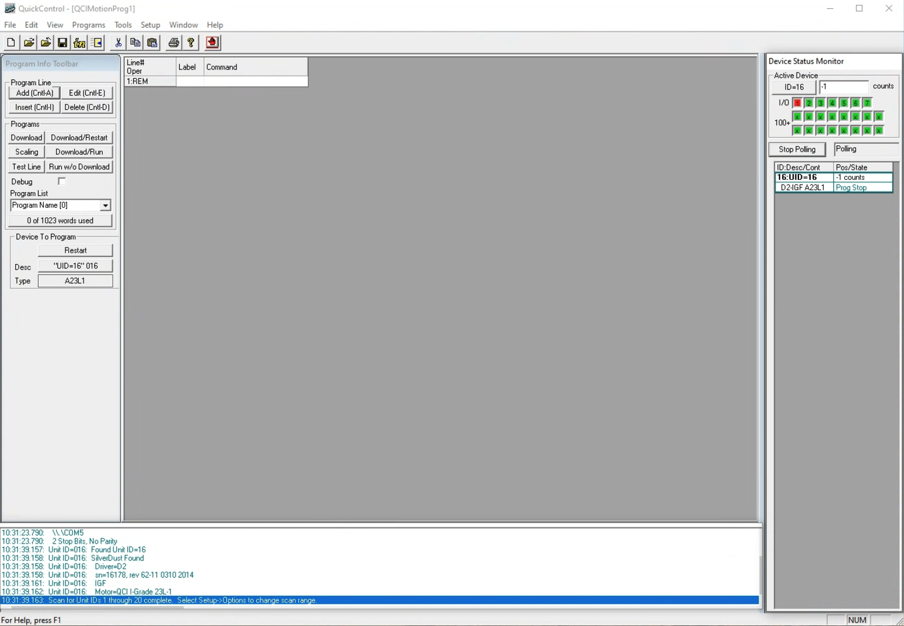
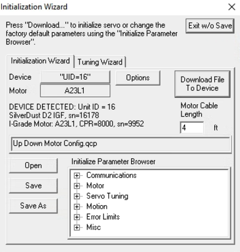

# Instructions on replacing the driver box for QuickSilver servo motors

The Rapid system uses QuickSilver servo motors for precise control of the XY stage, up-down motor, and rotation motor (three for the snakechain systems and four for the XY systems). Each motor is driven by a QuickSilver driver box (model #QCI-D2-IGF RoHS). 

In summer 2025, the previous Berkeley Rapid system was "upgraded" and installed at the IRM. In November 2025, the up-down control was malfunctioning. We suspect that the driver box for the up-down motor is faulty. This document provides instructions on how to replace the driver box.

## Replacing the driver box
1. **Power down the system**: Ensure that the power supply to the motor control system is shut off. 
2. **Locate the driver box**: Open up the top panel of the motor control box and unscrew the driver box from its mounting position. 

3. **Replace the driver box**: Disconnect the wiring harness from the faulty driver box and connect it to the new driver box. Secure the new driver box in place by screwing it back into its mounting position. Turn on the power supply.
4. **Download the hardware configuration into the new driver box**: A new driver box does not come with a pre-programmed hardware that works with the Rapid system software. We need to download the correct hardware configuration into the new driver box using the QuickSilver QuickControl software. 
   - Connect a computer to the driver box using a USB-to-serial adapter.
   - Make sure the Rapid Paleomag software is not running while performing this step. If it is running, we will not be able to connec to the driver box via QuickControl.
   - Open the QuickControl software, go to Setup>Comm Port 
   - Establish a connection to the driver box, make sure to check the box to enable connection, then go to Modify, select the corresponding COM port 
   - Once the Comm Port communication is established, go to Device Status Monitor panel and click button Scan Network. Once the software finds the driver box connected at this port, the button will change to _Stop Polling_, you should see the device has a UID of 16, and that there are counts shown in the Pos/State column. This means successful Polling state. An example view of the software panel is shown below: 
   - Now go to Tools > Initialization_wizard to download a previously prepared driver configuration program into the new driver. Click Open to navigate to a .qcp file, then modify the motor cable length to the correct length, then click Download File To Device to burn in the program.  
   - Once the download is complete, quit the QuickControl software, open back up Paleomag Rapid software, and test the motor control.