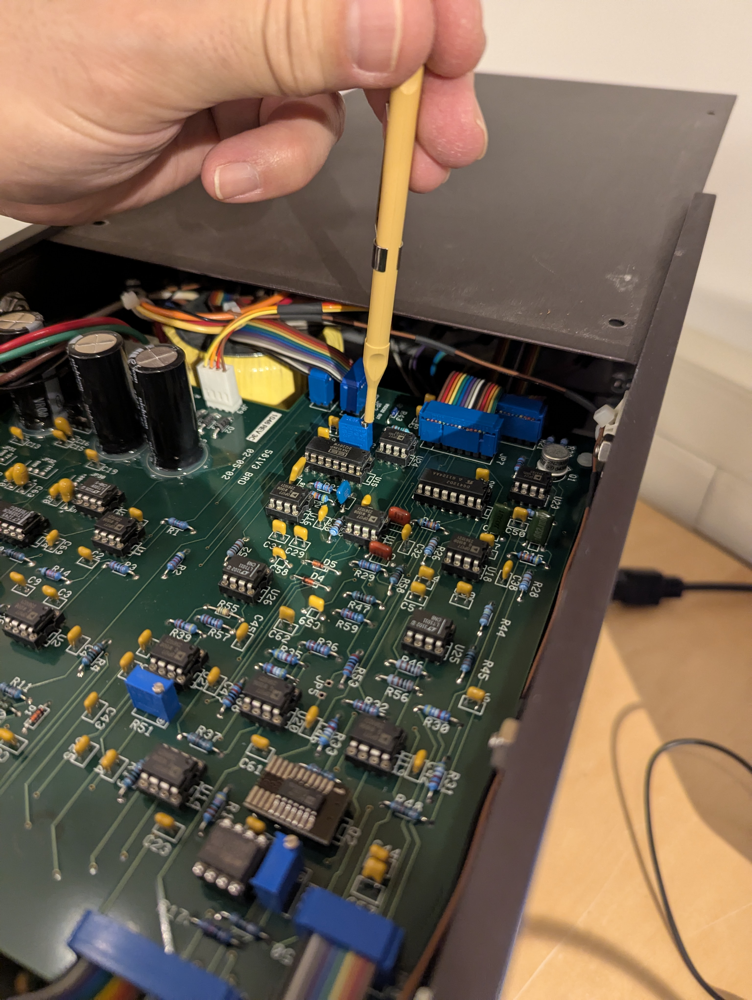
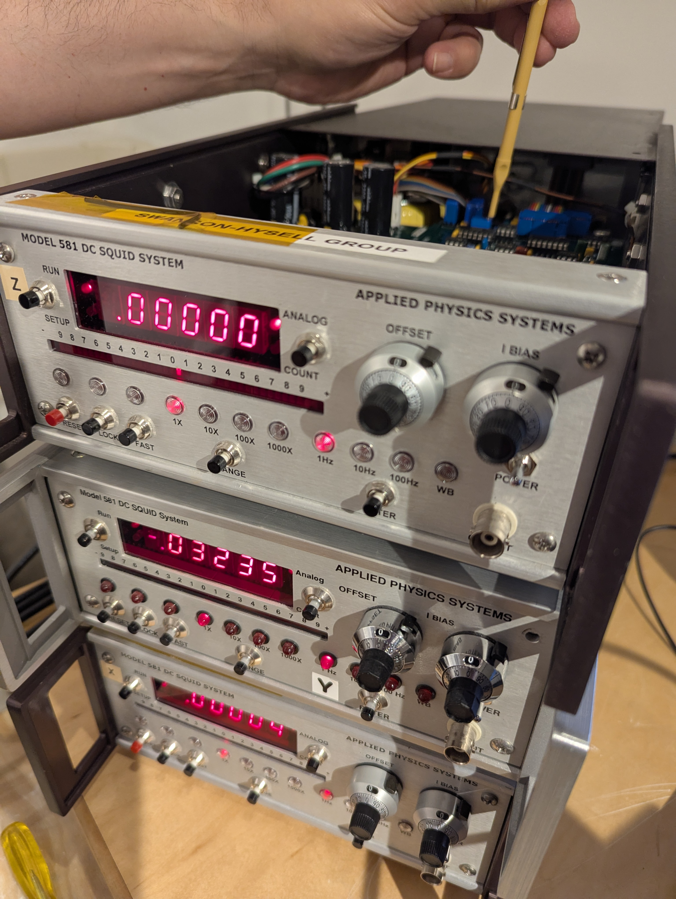

# Testing and adjusting the flux quanta voltage response

## Background

One flux quanta should be 1 V on the Model 581 DC SQuID boxes. The calibration is set in the gold amplifier box using the "CAL POT" (calibration potentiometer). This calibration should be stable, but should be checked annually. The voltage change with one flux quanta should be within 1% of 1 V when checked.

## Checking the voltage change

Tune the SQuID following the steps in [SQuID_tuning](SQuID_tuning.md).With lock on and range at 1x, adjust offset knob until readout is 0.600. Then press reset button and the readout should go to -0.400 (because one flux quanta should be 1 V). *Note: you can set to any offset value above 0.500 and then see that you go to that value minus one.*

If the voltage difference is appreciably different than 1 V (i.e. >1%), the CAL POT within the gold amplifier box should be adjusted.

## Adjusting the CAL POT

The left panel (facing from outside of the magnetometer towards the magnetometer) of the gold box should be removed. The CAL POT is the lowermost white square. A special screwdriver needs to be used with a plastic (non-conducting) sleeve. The reason for using a non-conducting screwdriver is if you slipped off the potentiometer and touched a conducting screwdriver to somewhere else on the circuit board, you could fry the very valuable amplifier.

You want to adjust the potentiometer to split the difference between what the value should be and what it is. That is if you started at 0.600 and it went to -0.450, you should adjust to -0.425. You then repeat checking the voltage difference by returning the value to 0.600 and pressing reset again. Keep iterating until the voltage difference is <1% of 1 V.

## Zeroing the bias

Another necessary adjustment is to zero the bias. On the 581 DC SQuID box, there is a BIAS knob. With the SQuID unlocked, and the box set to analog mode, turn the BIAS knob all the way counter-clockwise such that the readout on the knob is 0. The readout on the SQuID should also be 0. If it is not, open up the top panel of the 581 console box and adjust the potentiometer shown in the image below until the read out is 0. Re-tune the SQuID afterwards. 

